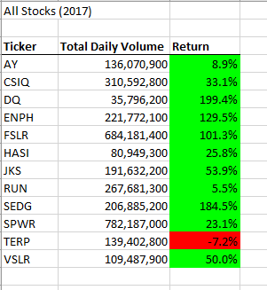
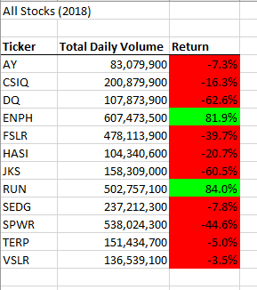
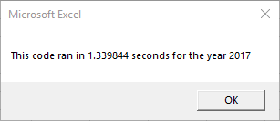
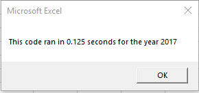
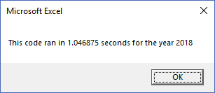
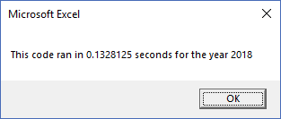

# Stock Analysis using VBA

## Overview of Project:

Use of Visual Basic for Applications (VBA) in Microsoft Excel to analyze Wall Street stock information documented in the "green_stocks.xlsx" dataset.

### Purpose:

VBA based analysis of the companies included in the stock dataset will allow users with limited Excel knowledge/experience to execute pre-configured macros in the file to organize, format, and analyze each stock ticker's Total Daily Volume and Return percentage.  

The macro available for execution within the Excel file will procss through the daily closing prices for each stock ticker to provide an overall summary of the total daily volume and return percentage for all the included stock tickers.  Additionally, the macro will format the summary table per year (2017 and 2018 in this case) to highlight which stocks had positive return percentage for the year and which had negative.

## Analysis and Challenges:

### Analysis of Stock Performance

Reviewing the twelve stocks tracked in this analysis, the 2017 performance would suggest that all but one of the stocks had a positive return percentage.  With a third of the eleven stocks having a greater than 100% return making most of the stocks appear very desirable based on 2017 analysis alone.

When compared to 2018 performance though, almost all twelve stocks except two had a negative return percentage.  And of the ten stocks with negative return, a thirds had a negative return greater than 35%.  Only the "ENPH" and "RUN" companies retained a positive return percentage in both 2017 and 2018.

Changing the macro code will speed up the macro execution time and simplify the overall macro configuration allowing for a larger number of stocks and their daily figures to be processed and anaylzed.  In this case, following code refactoring, the macro execution for the 2017 and 2018 datasets only required approximately 10% of the original execution time.  

####2017 code execution times

####2018 code execution times

## Summary

1) What are the advantages or disadvantages of refactoring code
*Advantages of refactoring code is and easier to understand and maintain code that should increase the execution speed of the code.  Additionally refactoring code allows for new perspectives on code configuration that the original author may not have known was an option.

*Disadvantages of refactoring code is that it can be a time consuming activity and there may not be more efficient or cleaner options available.

2) How do these pros and cons apply to refactoring the original VBA script?
Refactoring the original code has allowed for nested loops to be removed leaving more flexible code that executes more efficiently and allows more stock tickers to be evaluated in the future.  The downside of refactoring the original VBA script was the time spent on understanding creation of the index variable and correctly applying it to the looping logic.
